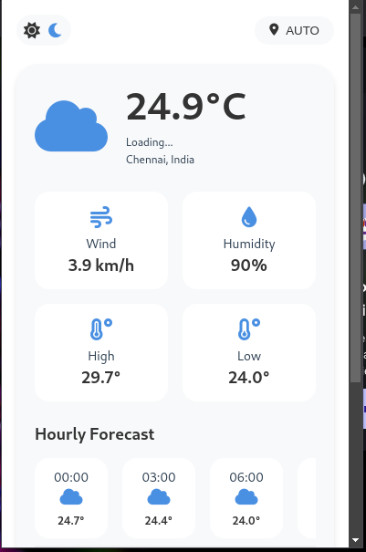
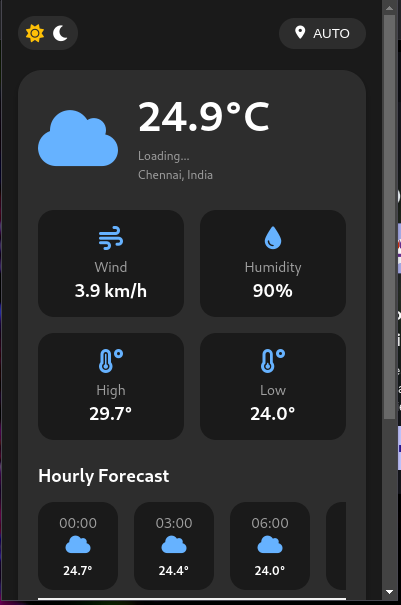

# ⛅ Weather Dashboard Extension

A sleek, modern weather dashboard browser extension built with HTML, CSS, and JavaScript.


## 🌟 Features

- 🌓 Dark/Light theme support
- 📍 Automatic location detection
- 🌡️ Real-time weather updates
- 📊 Hourly and 7-day forecasts
- 🔄 Customizable refresh intervals
- 🌍 Manual location override
- 🌡️ Temperature unit conversion (°C/°F)

## 🖥️ Preview




## 🚀 Installation

1. Clone the repository
```bash
git clone https://github.com/Sanjai-Shaarugesh/weather-browser-extension
```

2. Load the extension in your browser
- Chrome:
  - Navigate to `chrome://extensions/`
  - Enable "Developer mode"
  - Click "Load unpacked"
  - Select the extension directory

## ⚙️ Configuration

### API Keys
Create a `config.js` file in the project root:
```javascript
const CONFIG = {
  WEATHER_API_KEY: 'your_api_key_here'
};
```

### Settings
Available customization options:
- 🌡️ Temperature units (Celsius/Fahrenheit)
- ⏱️ Refresh intervals (15/30/60 minutes)
- 📍 Location mode (Auto/Manual)

## 🎨 Theme Preview

| Feature | Light Theme | Dark Theme |
|---------|-------------|------------|
| Background | `#ffffff` | `#1a1a1a` |
| Primary Color | `#4a90e2` | `#66b2ff` |
| Card Background | `#f8f9fa` | `#2d2d2d` |

## 🛠️ Tech Stack

- ⚡ Vanilla JavaScript
- 🎨 Custom CSS with CSS Variables
- 💻 HTML5
- 📦 Font Awesome Icons
- ⚛️ React (for settings panel)

## 📝 Contributing

1. Fork the repository
2. Create your feature branch (`git checkout -b feature/AmazingFeature`)
3. Commit changes (`git commit -m 'Add AmazingFeature'`)
4. Push to branch (`git push origin feature/AmazingFeature`)
5. Open a Pull Request

## 📄 License

Distributed under the MIT License. See `LICENSE` for more information.

## 👥 Contributors

## 🌟 Acknowledgments

- Weather data provided by OpenWeather API
- Icons by Font Awesome
- Design inspired by Material Design principles